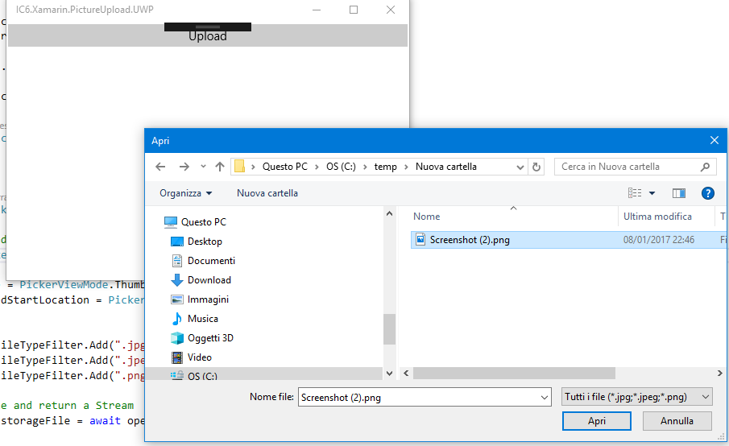

# IC6.Xamarin.UploadImage
Code sample with [ASP.Net Core](https://docs.microsoft.com/en-us/aspnet/core/) backend and [Xamarin.Forms](https://www.xamarin.com/forms) front-end to manage file upload.

# References
This is the code for the [related blog-post](https://ilclubdellesei.wordpress.com/2018/02/14/how-to-upload-images-to-an-asp-net-core-rest-service-with-xamarin-forms/) on [il club delle sei](https://ilclubdellesei.wordpress.com). 
